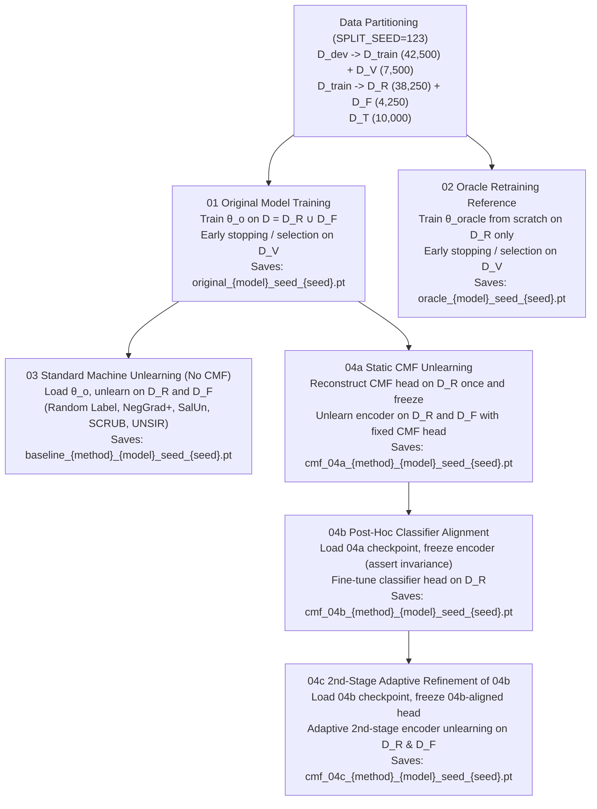

# End-to-End Unlearning Experiment Data Flow & Code Trace

This document aggregates the complete executable code tracing the dataset flow, model transitions, three-tier evaluations, and privacy/MIA assessments across all experiment stages:



---

## 0. Shared Dataset Setup, Probing Protocol & Privacy Evaluation

### Evaluation Protocol Categorization
The evaluation framework is strictly separated into three distinct, non-overlapping categories:

1. **Accuracy / Utility**:
   - `output_retain`: Retention accuracy on the retain training partition $\mathcal{D}_R$ (following Deep Unlearn benchmark definition).
   - `output_forget`: Accuracy on forgotten training partition $\mathcal{D}_F$.
   - `output_test`: Out-of-sample generalization accuracy on official unseen test set $\mathcal{D}_T$.
2. **Representation Diagnostic (Linear Probe & NCC)**:
   - `lp_retain`, `ncc_retain`: **In-sample representation diagnostic** measuring linear separability and centroid clustering on $\mathcal{D}_R$ representations.
   - `lp_forget`, `ncc_forget`: Representation unlearning efficacy on $\mathcal{D}_F$ representations.
   - `lp_test`, `ncc_test`: Out-of-sample representation retention on unseen test set $\mathcal{D}_T$.
   - `illusion_gap_lp`, `illusion_gap_ncc`: $\max(\text{Rep}_F - \text{Out}_F, 0)$.
3. **Privacy / Membership Inference Attack (MIA)**:
   - `mia_forget`: AUC-ROC of distinguishing forgotten samples $\mathcal{D}_F$ from unseen non-members ($\mathcal{D}_V$ or $\mathcal{D}_T$).
   - `disc_forget`: Discernibility $|\text{2} \times \text{MIA} - 1| \in [0, 1]$.
   - `indisc_forget`: Indiscernibility $1 - \text{Disc} \in [0, 1]$ (where $1.0$ indicates perfect privacy indistinguishability).

```python
import os
import json
import copy
import time
from typing import Dict, List, Tuple, Union, Optional
import numpy as np
import torch
import torch.nn as nn
import torch.nn.functional as F
import torch.optim as optim
from torch.utils.data import DataLoader, Dataset, Subset
from torchvision import datasets, transforms
from sklearn.linear_model import LogisticRegression
from sklearn.metrics import roc_auc_score

# ---------------------------------------------------------
# Transforms
# ---------------------------------------------------------
def get_dataset_transforms(dataset_name: str = "cifar10"):
    dataset_name = dataset_name.lower().replace("-", "_")
    if dataset_name == "cifar10":
        mean, std = [0.4919, 0.4822, 0.4465], [0.2023, 0.1994, 0.2010]
        train_tf = transforms.Compose([
            transforms.RandomCrop(32, padding=4),
            transforms.RandomHorizontalFlip(0.5),
            transforms.ToTensor(),
            transforms.Normalize(mean=mean, std=std),
        ])
        eval_tf = transforms.Compose([
            transforms.Resize((32, 32)),
            transforms.ToTensor(),
            transforms.Normalize(mean=mean, std=std),
        ])
    elif dataset_name == "cifar100":
        mean, std = [0.5071, 0.4865, 0.4409], [0.2673, 0.2564, 0.2762]
        train_tf = transforms.Compose([
            transforms.RandomCrop(32, padding=4),
            transforms.RandomHorizontalFlip(0.5),
            transforms.ToTensor(),
            transforms.Normalize(mean=mean, std=std),
        ])
        eval_tf = transforms.Compose([
            transforms.Resize((32, 32)),
            transforms.ToTensor(),
            transforms.Normalize(mean=mean, std=std),
        ])
    else:
        mean, std = [0.5, 0.5, 0.5], [0.5, 0.5, 0.5]
        train_tf = transforms.Compose([transforms.ToTensor(), transforms.Normalize(mean=mean, std=std)])
        eval_tf = transforms.Compose([transforms.ToTensor(), transforms.Normalize(mean=mean, std=std)])
    return train_tf, eval_tf

# ---------------------------------------------------------
# Dynamic Transform Wrapper
# ---------------------------------------------------------
class IndexedDataset(Dataset):
    def __init__(self, dataset: Dataset, transform=None):
        self.dataset = dataset
        self.transform = transform

    def __getitem__(self, idx: int):
        x, y = self.dataset[idx]
        if self.transform is not None:
            x = self.transform(x)
        return x, y

    def __len__(self) -> int:
        return len(self.dataset)

# ---------------------------------------------------------
# Split Creation, Validation & Persistence
# ---------------------------------------------------------
def create_and_persist_splits(
    dataset_name: str = "cifar10",
    root: str = "./data",
    seed: int = 123,
    save_dir: str = "./artifacts/splits",
) -> Dict[str, Union[List[int], str, int]]:
    os.makedirs(save_dir, exist_ok=True)
    split_filename = os.path.join(save_dir, f"{dataset_name}_seed_{seed}_split.json")
    
    if os.path.exists(split_filename):
        with open(split_filename, "r") as f:
            split_artifact = json.load(f)
        # Validate loaded split integrity and disjointness
        train_idx = set(split_artifact["train_indices"])
        val_idx = set(split_artifact["val_indices"])
        train_r_idx = set(split_artifact["train_r_indices"])
        train_f_idx = set(split_artifact["train_f_indices"])
        assert len(train_idx.intersection(val_idx)) == 0, "Train and Val overlap"
        assert len(train_r_idx.intersection(train_f_idx)) == 0, "Retain and Forget overlap"
        assert train_r_idx.union(train_f_idx) == train_idx, "Retain union Forget != Train"
        return split_artifact

    if dataset_name.lower() in ["cifar10", "cifar100"]:
        ds_cls = datasets.CIFAR10 if dataset_name.lower() == "cifar10" else datasets.CIFAR100
        raw_train = ds_cls(root=root, train=True, download=True)
        raw_test = ds_cls(root=root, train=False, download=True)
        train_size, val_size = 42500, 7500
        retain_size, forget_size = 38250, 4250
    else:
        raise ValueError(f"Unsupported dataset: {dataset_name}")

    gen = torch.Generator().manual_seed(seed)
    dev_perm = torch.randperm(len(raw_train), generator=gen).tolist()
    train_indices = dev_perm[:train_size]
    val_indices = dev_perm[train_size:train_size + val_size]
    test_indices = list(range(len(raw_test)))

    train_perm = torch.randperm(len(train_indices), generator=gen).tolist()
    train_r_indices = [train_indices[i] for i in train_perm[:retain_size]]
    train_f_indices = [train_indices[i] for i in train_perm[retain_size:]]

    split_artifact = {
        "dataset_name": dataset_name,
        "seed": seed,
        "train_indices": train_indices,
        "val_indices": val_indices,
        "test_indices": test_indices,
        "train_r_indices": train_r_indices,
        "train_f_indices": train_f_indices,
    }
    with open(split_filename, "w") as f:
        json.dump(split_artifact, f)
    return split_artifact

# ---------------------------------------------------------
# Membership Inference Attack (MIA) Evaluation
# ---------------------------------------------------------
@torch.no_grad()
def compute_mia_metrics(
    model: nn.Module,
    forget_loader: DataLoader,
    nonmember_loader: DataLoader,
    device: str = "cuda"
) -> Dict[str, float]:
    model.eval()
    criterion = nn.CrossEntropyLoss(reduction="none")

    forget_losses, nonmember_losses = [], []
    for images, targets in forget_loader:
        images = images.to(device)
        targets = targets.to(device) if isinstance(targets, torch.Tensor) else torch.tensor(targets, device=device)
        loss = criterion(model(images), targets)
        forget_losses.extend(loss.cpu().numpy().tolist())

    for images, targets in nonmember_loader:
        images = images.to(device)
        targets = targets.to(device) if isinstance(targets, torch.Tensor) else torch.tensor(targets, device=device)
        loss = criterion(model(images), targets)
        nonmember_losses.extend(loss.cpu().numpy().tolist())

    if len(forget_losses) == 0 or len(nonmember_losses) == 0:
        return {"mia_forget": 0.5, "disc_forget": 0.0, "indisc_forget": 1.0}

    y_true = np.concatenate([np.ones(len(forget_losses)), np.zeros(len(nonmember_losses))])
    # Lower loss indicates higher membership likelihood -> score = -loss
    scores = -np.concatenate([np.array(forget_losses), np.array(nonmember_losses)])

    try:
        mia = float(roc_auc_score(y_true, scores))
    except Exception:
        mia = 0.5

    disc = float(abs(2.0 * mia - 1.0))
    indisc = float(1.0 - disc)
    return {"mia_forget": mia, "disc_forget": disc, "indisc_forget": indisc}

# ---------------------------------------------------------
# Comprehensive Evaluation Pipeline Across All Categories
# ---------------------------------------------------------
@torch.no_grad()
def extract_features(encoder: nn.Module, dataloader: DataLoader, device: str = "cuda"):
    encoder.eval()
    all_feats, all_targets = [], []
    for images, targets in dataloader:
        images = images.to(device)
        feats = encoder(images)
        all_feats.append(feats.cpu().numpy())
        all_targets.append(targets.numpy() if isinstance(targets, torch.Tensor) else np.array(targets))
    return np.concatenate(all_feats, axis=0), np.concatenate(all_targets, axis=0)

def compute_output_accuracy(model: nn.Module, dataloader: DataLoader, device: str = "cuda") -> float:
    model.eval()
    correct, total = 0, 0
    with torch.no_grad():
        for images, targets in dataloader:
            images = images.to(device)
            targets = targets.to(device) if isinstance(targets, torch.Tensor) else torch.tensor(targets, device=device)
            preds = model(images).argmax(dim=1)
            correct += (preds == targets).sum().item()
            total += targets.size(0)
    return float(correct / total) if total > 0 else 0.0

def compute_linear_probe_accuracy(train_feats, train_targets, eval_feats, eval_targets, seed=123) -> float:
    if len(eval_feats) == 0: return 0.0
    clf = LogisticRegression(max_iter=1000, random_state=seed, solver="lbfgs")
    clf.fit(train_feats, train_targets)
    preds = np.array(clf.predict(eval_feats))
    return float(np.mean(preds == np.array(eval_targets)))

def compute_ncc_accuracy(train_feats, train_targets, eval_feats, eval_targets, num_classes=10) -> float:
    if len(eval_feats) == 0: return 0.0
    class_means = []
    for c in range(num_classes):
        mask = (train_targets == c)
        mean = train_feats[mask].mean(axis=0) if mask.sum() > 0 else np.zeros(train_feats.shape[1])
        class_means.append(mean)
    class_means = np.stack(class_means, axis=0)
    dists = np.linalg.norm(eval_feats[:, None, :] - class_means[None, :, :], axis=2)
    preds = np.argmin(dists, axis=1)
    return float(np.mean(preds == np.array(eval_targets)))

def evaluate_three_tier_metrics(
    model, probe_train_loader, retain_eval_loader, forget_eval_loader,
    num_classes=10, seed=123, device="cuda", test_eval_loader=None, nonmember_loader=None
):
    # 1. Accuracy / Utility
    out_r = compute_output_accuracy(model, retain_eval_loader, device=device)
    out_f = compute_output_accuracy(model, forget_eval_loader, device=device)

    # 2. Representation Diagnostics (In-sample D_R diagnostic, out-of-sample D_F / D_T)
    train_feats, train_targets = extract_features(model.encoder, probe_train_loader, device=device)
    r_feats, r_targets = extract_features(model.encoder, retain_eval_loader, device=device)
    f_feats, f_targets = extract_features(model.encoder, forget_eval_loader, device=device)

    lp_r = compute_linear_probe_accuracy(train_feats, train_targets, r_feats, r_targets, seed=seed)
    lp_f = compute_linear_probe_accuracy(train_feats, train_targets, f_feats, f_targets, seed=seed)
    ncc_r = compute_ncc_accuracy(train_feats, train_targets, r_feats, r_targets, num_classes=num_classes)
    ncc_f = compute_ncc_accuracy(train_feats, train_targets, f_feats, f_targets, num_classes=num_classes)

    res = {
        # Category 1: Accuracy / Utility
        "output_retain": out_r, "output_forget": out_f,
        # Category 2: Representation
        "lp_retain": lp_r, "lp_forget": lp_f,
        "ncc_retain": ncc_r, "ncc_forget": ncc_f,
        "illusion_gap_lp": max(lp_f - out_f, 0.0),
        "illusion_gap_ncc": max(ncc_f - out_f, 0.0),
    }

    if test_eval_loader is not None:
        res["output_test"] = compute_output_accuracy(model, test_eval_loader, device=device)
        t_feats, t_targets = extract_features(model.encoder, test_eval_loader, device=device)
        res["lp_test"] = compute_linear_probe_accuracy(train_feats, train_targets, t_feats, t_targets, seed=seed)
        res["ncc_test"] = compute_ncc_accuracy(train_feats, train_targets, t_feats, t_targets, num_classes=num_classes)

    # 3. Privacy / Membership Inference (U-MIA)
    nm_loader = nonmember_loader if nonmember_loader is not None else retain_eval_loader
    mia_res = compute_mia_metrics(model, forget_eval_loader, nm_loader, device=device)
    res.update(mia_res)
    return res
```

---

## 1. Notebook 01 — Original Model Training ($\theta_o$)

Trains model on complete training set $D = D_R \cup D_F$, selects checkpoint via $D_V$, and records baseline utility, representation, and privacy metrics.

```python
train_tf, eval_tf = get_dataset_transforms("cifar10")
raw_train = datasets.CIFAR10(root="./data", train=True, download=True)
raw_test = datasets.CIFAR10(root="./data", train=False, download=True)
split_info = create_and_persist_splits("cifar10", seed=123)

train_set = IndexedDataset(Subset(raw_train, split_info["train_indices"]), train_tf)
val_set = IndexedDataset(Subset(raw_train, split_info["val_indices"]), eval_tf)
train_r_eval_set = IndexedDataset(Subset(raw_train, split_info["train_r_indices"]), eval_tf)
train_f_eval_set = IndexedDataset(Subset(raw_train, split_info["train_f_indices"]), eval_tf)
test_set = IndexedDataset(Subset(raw_test, split_info["test_indices"]), eval_tf)

train_loader = DataLoader(train_set, batch_size=256, shuffle=True, num_workers=2, pin_memory=True)
val_loader = DataLoader(val_set, batch_size=256, shuffle=False, num_workers=2, pin_memory=True)
train_r_eval_loader = DataLoader(train_r_eval_set, batch_size=256, shuffle=False)
train_f_eval_loader = DataLoader(train_f_eval_set, batch_size=256, shuffle=False)
test_loader = DataLoader(test_set, batch_size=256, shuffle=False)

model = build_classifier(model_name="resnet18", num_classes=10).to(device)
optimizer = optim.SGD(model.parameters(), lr=0.1, momentum=0.9, weight_decay=5e-4)
scheduler = optim.lr_scheduler.CosineAnnealingLR(optimizer, T_max=182)
criterion = nn.CrossEntropyLoss()

best_val_acc, best_state = 0.0, None
for epoch in range(1, 183):
    model.train()
    for images, targets in train_loader:
        images, targets = images.to(device), targets.to(device)
        optimizer.zero_grad()
        loss = criterion(model(images), targets)
        loss.backward()
        optimizer.step()
    scheduler.step()

    val_acc = compute_output_accuracy(model, val_loader, device=device)
    if val_acc > best_val_acc:
        best_val_acc = val_acc
        best_state = copy.deepcopy(model.state_dict())

model.load_state_dict(best_state)
torch.save(best_state, "./artifacts/checkpoints/original_resnet18_seed_0.pt")

test_metrics = evaluate_three_tier_metrics(
    model=model,
    probe_train_loader=train_r_eval_loader,
    retain_eval_loader=train_r_eval_loader,
    forget_eval_loader=train_f_eval_loader,
    num_classes=10, seed=0, device=device,
    test_eval_loader=test_loader,
    nonmember_loader=val_loader
)
```

---

## 2. Notebook 02 — Oracle Retraining Reference ($\theta_{oracle}$)

Retrained from scratch strictly on $D_R$ without ever observing $D_F$.

```python
retain_train_set = IndexedDataset(Subset(raw_train, split_info["train_r_indices"]), train_tf)
retain_train_loader = DataLoader(retain_train_set, batch_size=256, shuffle=True, num_workers=2, pin_memory=True)

oracle_model = build_classifier(model_name="resnet18", num_classes=10).to(device)
optimizer = optim.SGD(oracle_model.parameters(), lr=0.1, momentum=0.9, weight_decay=5e-4)
scheduler = optim.lr_scheduler.CosineAnnealingLR(optimizer, T_max=182)
criterion = nn.CrossEntropyLoss()

best_val_acc, best_state = 0.0, None
for epoch in range(1, 183):
    oracle_model.train()
    for images, targets in retain_train_loader:
        images, targets = images.to(device), targets.to(device)
        optimizer.zero_grad()
        loss = criterion(oracle_model(images), targets)
        loss.backward()
        optimizer.step()
    scheduler.step()

    val_acc = compute_output_accuracy(oracle_model, val_loader, device=device)
    if val_acc > best_val_acc:
        best_val_acc = val_acc
        best_state = copy.deepcopy(oracle_model.state_dict())

oracle_model.load_state_dict(best_state)
torch.save(best_state, "./artifacts/checkpoints/oracle_resnet18_seed_0.pt")

test_metrics = evaluate_three_tier_metrics(
    model=oracle_model,
    probe_train_loader=train_r_eval_loader,
    retain_eval_loader=train_r_eval_loader,
    forget_eval_loader=train_f_eval_loader,
    num_classes=10, seed=0, device=device,
    test_eval_loader=test_loader,
    nonmember_loader=val_loader
)
```

---

## 3. Notebook 03 — Standard Machine Unlearning Baselines ($\theta_o \to \theta_u$)

Loads $\theta_o$ and executes standard baseline unlearning (Random Label, NegGrad+, SalUn, SCRUB, UNSIR) without representation-level CMF constraints.

```python
train_r_set = IndexedDataset(Subset(raw_train, split_info["train_r_indices"]), train_tf)
train_f_set = IndexedDataset(Subset(raw_train, split_info["train_f_indices"]), train_tf)
train_r_loader = DataLoader(train_r_set, batch_size=256, shuffle=True, num_workers=2, pin_memory=True)
train_f_loader = DataLoader(train_f_set, batch_size=256, shuffle=True, num_workers=2, pin_memory=True)

model = build_classifier(model_name="resnet18", num_classes=10).to(device)
model.load_state_dict(torch.load("./artifacts/checkpoints/original_resnet18_seed_0.pt", map_location=device))

# Baseline Unlearning (e.g., SCRUB / SalUn / NegGrad+)
unlearned_model = unlearn_salun(
    model, retain_loader=train_r_loader, forget_loader=train_f_loader,
    num_classes=10, threshold=0.5, lr=1e-4, epochs=3, device=device
)

torch.save(unlearned_model.state_dict(), "./artifacts/checkpoints/baseline_salun_resnet18_seed_0.pt")

test_metrics = evaluate_three_tier_metrics(
    model=unlearned_model,
    probe_train_loader=train_r_eval_loader,
    retain_eval_loader=train_r_eval_loader,
    forget_eval_loader=train_f_eval_loader,
    num_classes=10, seed=0, device=device,
    test_eval_loader=test_loader,
    nonmember_loader=val_loader
)
```

---

## 4a. Notebook 04a — Static Class-Mean Feature (CMF) Unlearning

In strict **Static CMF**, the classifier head is constructed **once before unlearning** from clean retain centroids on $\mathcal{D}_R$, frozen in-place, and remains fixed during the entire unlearning process. No second reconstruction or post-unlearning head reset is performed.

```python
@torch.no_grad()
def reconstruct_cmf_head(model, dataloader, num_classes=10, device="cuda"):
    feats, targets = extract_features(model.encoder, dataloader, device=device)
    class_means = []
    for c in range(num_classes):
        mask = (targets == c)
        mean = feats[mask].mean(axis=0) if mask.sum() > 0 else np.zeros(feats.shape[1])
        class_means.append(mean)
    class_means = np.stack(class_means, axis=0) # [C, D]
    centered = class_means - class_means.mean(axis=0, keepdims=True)
    normalized_weights = centered / (np.linalg.norm(centered, axis=1, keepdims=True) + 1e-8)
    
    # Assign and freeze static CMF head
    model.head.linear.weight.data.copy_(torch.tensor(normalized_weights, dtype=torch.float32, device=device))
    if model.head.linear.bias is not None:
        model.head.linear.bias.data.zero_()
        model.head.linear.bias.requires_grad = False
    model.head.linear.weight.requires_grad = False

# 1. Load θ_o
model = build_classifier(model_name="resnet18", num_classes=10).to(device)
model.load_state_dict(torch.load("./artifacts/checkpoints/original_resnet18_seed_0.pt", map_location=device))

# 2. Reconstruct CMF head once before unlearning and freeze
reconstruct_cmf_head(model, train_r_eval_loader, num_classes=10, device=device)

# 3. Unlearn Encoder with fixed CMF head
unlearned_model = unlearn_scrub(
    model, retain_loader=train_r_loader, forget_loader=train_f_loader,
    epochs=3, msteps=2, lr=1e-4, device=device
)

# 4. Save 04a Checkpoint (evaluated directly with static CMF head)
torch.save(unlearned_model.state_dict(), "./artifacts/checkpoints/cmf_04a_scrub_resnet18_seed_0.pt")

test_metrics = evaluate_three_tier_metrics(
    model=unlearned_model,
    probe_train_loader=train_r_eval_loader,
    retain_eval_loader=train_r_eval_loader,
    forget_eval_loader=train_f_eval_loader,
    num_classes=10, seed=0, device=device,
    test_eval_loader=test_loader,
    nonmember_loader=val_loader
)
```

---

## 4b. Notebook 04b — Post-Hoc Classifier Alignment

Loads the 04a checkpoint, strictly freezes the encoder (verified via weight diff invariant check), and fine-tunes only the classification head on $D_R$ to align decision boundaries.

```python
# 1. Load 04a checkpoint
model = build_classifier(model_name="resnet18", num_classes=10).to(device)
model.load_state_dict(torch.load("./artifacts/checkpoints/cmf_04a_scrub_resnet18_seed_0.pt", map_location=device))

# 2. Freeze Encoder & Verify Invariance
for p in model.encoder.parameters():
    p.requires_grad = False
model.encoder.eval()

# Unfreeze classifier head for SGD tuning
for p in model.head.parameters():
    p.requires_grad = True

init_encoder_state = copy.deepcopy(model.encoder.state_dict())
optimizer = optim.SGD(model.head.parameters(), lr=1e-3, momentum=0.9, weight_decay=5e-4)
criterion = nn.CrossEntropyLoss()

# 3. Fine-tune linear head on clean D_R for 5 epochs
for epoch in range(1, 6):
    model.encoder.eval()
    model.head.train()
    for images, targets in train_r_loader:
        images, targets = images.to(device), targets.to(device)
        optimizer.zero_grad()
        with torch.no_grad():
            feats = model.encoder(images)
        out = model.head(feats)
        loss = criterion(out, targets)
        loss.backward()
        optimizer.step()

# 4. Strict Invariance Check
curr_encoder_state = model.encoder.state_dict()
for k in init_encoder_state:
    diff = torch.norm(init_encoder_state[k].float() - curr_encoder_state[k].float()).item()
    assert diff == 0.0, f"Encoder invariance violated on {k}"

# 5. Save 04b Checkpoint
torch.save(model.state_dict(), "./artifacts/checkpoints/cmf_04b_scrub_resnet18_seed_0.pt")
```

---

## 4c. Notebook 04c — 2nd-Stage Adaptive Refinement of 04b

Notebook 04c is defined strictly as:
$$\text{04b Model} \xrightarrow{\text{freeze 04b head}} \text{Adaptive Encoder Refinement (low-LR)} \to \text{Final Model}$$
The 04b-aligned head is preserved (frozen) to protect decision boundaries while the encoder undergoes low-LR secondary refinement.

```python
# 1. Load 04b checkpoint
model = build_classifier(model_name="resnet18", num_classes=10).to(device)
model.load_state_dict(torch.load("./artifacts/checkpoints/cmf_04b_scrub_resnet18_seed_0.pt", map_location=device))

# 2. Freeze 04b-aligned classifier head (preserve alignment)
for p in model.head.parameters():
    p.requires_grad = False

# 3. Low-LR 2nd-Stage Adaptive Refinement on Encoder
unlearned_model = unlearn_scrub(
    model, retain_loader=train_r_loader, forget_loader=train_f_loader,
    epochs=2, msteps=2, lr=2e-5, device=device
)

# 4. Save Final 04c Checkpoint & Evaluate
torch.save(unlearned_model.state_dict(), "./artifacts/checkpoints/cmf_04c_scrub_resnet18_seed_0.pt")

test_metrics = evaluate_three_tier_metrics(
    model=unlearned_model,
    probe_train_loader=train_r_eval_loader,
    retain_eval_loader=train_r_eval_loader,
    forget_eval_loader=train_f_eval_loader,
    num_classes=10, seed=0, device=device,
    test_eval_loader=test_loader,
    nonmember_loader=val_loader
)
```
